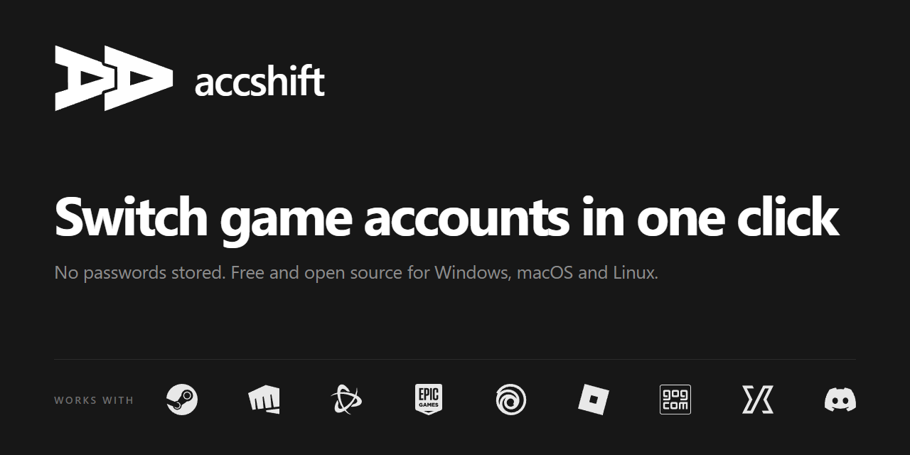
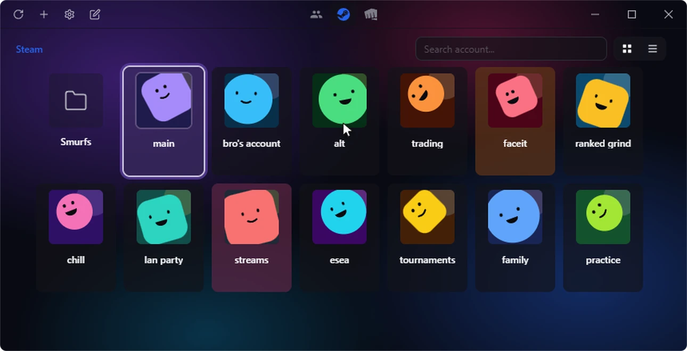

<h1 align="center">
  <a href="https://github.com/klNuno/accshift/releases/latest">
    
  </a>
</h1>

<p align="center">
  <a href="https://github.com/klNuno/accshift/releases/latest"></a>
  <a href="https://github.com/klNuno/accshift/releases"></a>
  <a href="#supported-platforms"></a>
  <a href="./LICENSE"></a>
  <a href="https://tauri.app/"></a>
  <a href="https://svelte.dev/"></a>
</p>

<p align="center">
  <a href="#installation"><b>Download</b></a>
  &nbsp;·&nbsp;
  <a href="#features"><b>Features</b></a>
  &nbsp;·&nbsp;
  <a href="#supported-platforms"><b>Platforms</b></a>
  &nbsp;·&nbsp;
  <a href="#cli"><b>CLI</b></a>
  &nbsp;·&nbsp;
  <a href="#privacy"><b>Privacy</b></a>
  &nbsp;·&nbsp;
  <a href="https://github.com/klNuno/accshift/wiki"><b>Wiki</b></a>
</p>

<p align="center">
  
</p>

Pick an account and the launcher restarts already signed in. accshift never
asks for your password: it saves the session the launcher already keeps, and
encrypts it on your machine.

## Installation

Grab the build for your OS from the
[latest release](https://github.com/klNuno/accshift/releases/latest):

| OS      | Package                    | Note                                                                                      |
| ------- | -------------------------- | ----------------------------------------------------------------------------------------- |
| Windows | NSIS or MSI installer      |                                                                                           |
| macOS   | `.dmg`                     | Unsigned for now: run `xattr -cr /Applications/Accshift.app` once if Gatekeeper complains |
| Linux   | `.deb`, `.rpm` or AppImage |                                                                                           |

Updates install from inside the app.

## Supported platforms

| Platform        | Windows | macOS | Linux |
| --------------- | :-----: | :---: | :---: |
| Steam           |   ✅    |  ✅   |  ✅   |
| Riot Games      |   ✅    |       |       |
| Battle.net      |   ✅    |  ✅   |       |
| Epic Games      |   ✅    |       |       |
| Ubisoft Connect |   ✅    |       |       |
| Roblox          |   ✅    |       |       |
| GOG Galaxy      |   🧪    |       |       |
| Jagex Launcher  |   🧪    |       |       |
| Discord         |   🧪    |       |       |

🧪 means the integration is built and working on my machine, but too few users
have reported back for me to call it stable. Expect bugs, and
[open an issue](https://github.com/klNuno/accshift/issues/new/choose) if you hit
one, or to ask for a platform that is not listed.

Most of these are a JSON descriptor rather than code, so you can add a launcher
of your own without compiling anything. The format, the sandbox rules and the
dry run are in [docs/platform-descriptors.md](./docs/platform-descriptors.md).

## Features

- **One-click switching** from the grid, or from the `Ctrl+K` command palette
  without touching the mouse.
- **Personas** group one account per platform under a single identity and
  switch them all at once.
- **Streamer mode** blurs account names and avatars while OBS, Streamlabs,
  XSplit, Wirecast or Twitch Studio is running.
- **CLI and deep links** (`accshift://`) for scripts, Stream Deck and
  automation.
- Optional **PIN lock**, on launch and after a period of inactivity.
- **7 languages**: English, Spanish, French, Portuguese, Brazilian Portuguese,
  Russian and Simplified Chinese.

### Organize a large library

Folders, search, drag and drop reordering, card colors and private notes for
large account collections.

<p align="center">
  
</p>

### Every launcher, every theme

The same grid for each platform, in Light, Dark or Midnight, with light and
dark acrylic variants and an experimental Liquid Glass theme. Themes are files
you can edit, import and export ([docs/theming.md](./docs/theming.md)).

<p align="center">
  
</p>

### Steam goes further

- Copy any game's settings from one account to another.
- Copy account info in one click: username, SteamID64, CS2 friend code,
  profile URL.
- **Bulk edit** several accounts at once: hide the game news popup at launch,
  toggle do not disturb, set launch options for any game.
- Game and community ban tracking.
- Switch in online or invisible mode, or switch and launch a game directly
  (the last game chosen is remembered).
- **CS2 Bridge**: let an app that tracks your accounts show CS2 level, XP
  progression and the weekly drop inside accshift. See
  [CS2-Bridge](https://github.com/klNuno/accshift/wiki/CS2-Bridge).

## CLI

`accshift` also ships as a command-line binary for scripts, Stream Deck macros
and AI automation. It reads and writes the same config as the GUI, and running
both at once is safe thanks to an exclusive lock on mutating operations.

```bash
accshift platforms                       # platforms known to this build
accshift list <platform>                 # accounts for a platform
accshift switch <platform> <account-id>  # switch, same as a click in the app
```

Output is a table in a terminal and JSON when piped, so scripts get a stable
contract without an extra flag. Install steps, every flag, the versioned JSON
envelope and the exit codes are in [docs/cli.md](./docs/cli.md).

## Privacy

- **No passwords.** accshift saves the session state needed to restore an
  account, session cookies included where required, and nothing else.
- **Encrypted at rest** with what the OS provides: DPAPI on Windows, Secret
  Service on Linux, Keychain on macOS. The threat model and what the PIN lock
  covers are in the [security policy](./.github/SECURITY.md).
- **Telemetry is a handful of anonymous counters**, and one switch in Settings, Privacy
  turns it off for good. Nothing is sent before you finish the first-launch
  screen, and no feature depends on it.

<details>
<summary>What is sent, and what never is</summary>

<br />

Never sent, in any mode: account names, platform identifiers such as SteamID,
passwords, tokens, cookies, persona or folder names, file paths, and your IP
address. An event can say "an account was added on Steam"; it cannot say which
account. What is sent is nine counters, the app and OS version, the locale, and
a country code.

[docs/analytics.md](./docs/analytics.md) lists every event and field, shows a
real payload, says where the data is stored and how to export or delete it. The
client is in
[`crates/accshift-core/src/telemetry/`](./crates/accshift-core/src/telemetry)
and the server in [`server/`](./server), both readable in a sitting.

</details>

## Building from source

```bash
pnpm install
pnpm tauri dev     # run the app with hot reload
pnpm tauri build   # installers for your OS
```

Setup, coding standards and how to propose a new platform are in the
[contributing guide](./.github/CONTRIBUTING.md). Technical references live in
[docs/](./docs/README.md).

<details>
<summary>Project structure</summary>

```text
src/lib/                          # Svelte frontend (GUI)
  app/                            # app lifecycle, dialogs, navigation
  features/folders notifications settings
  platforms/                      # per-platform UI adapters
  shared/components contextMenu platform ...
  storage/                        # client storage layer

crates/
  accshift-core/                  # platform logic, config, storage, OS
    src/
      platforms/steam riot ...    # hand-written platforms
      platforms/descriptor/       # JSON-described platforms and their engine
      os/windows linux macos      # per-OS primitives (sysinfo/open/keyring)
      context.rs                  # AppContext trait (replaces tauri::AppHandle)
      lock.rs                     # fs4 exclusive lock
      runtime.rs                  # tokio block_on helper
      config storage logging themes
  accshift-cli/                   # CLI binary (list, switch, platforms)

src-tauri/                        # Tauri GUI thin wrapper
  src/lib.rs commands.rs app_runtime.rs tauri_context.rs
  src/launcher.rs                 # Windows exe: starts WebView2, loads the app DLL

vendor/wry/                       # wry with an early WebView2 start (Windows)
```

</details>

## Disclaimer

<sub>
This project is not affiliated with Valve (Counter-Strike 2, Dota 2), Blizzard
(Overwatch 2, Diablo IV, WoW, Call of Duty), Riot Games (Valorant, League of
Legends, TFT), Epic Games (Fortnite, Rocket League), Ubisoft (Rainbow Six
Siege, The Division 2), Roblox Corporation, CD PROJEKT (GOG) (Cyberpunk 2077,
The Witcher 3), Jagex (RuneScape, Old School RuneScape), or Discord. Use at
your own risk.
</sub>
